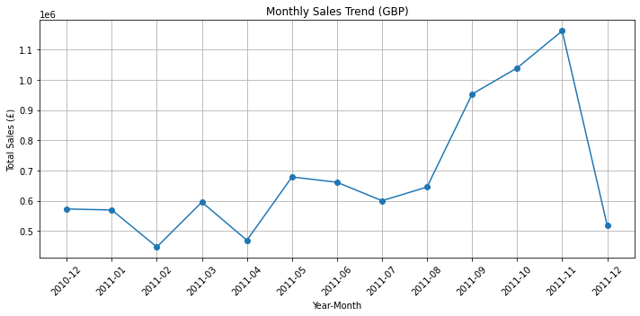

# 🛒 E-commerce Sales Analysis (2010–2011, UK)

This project presents a complete exploratory analysis of historical online retail transactions in the UK from December 2010 to December 2011, using Python (Pandas + Matplotlib) and Jupyter Notebook.

> 💱 All monetary amounts are in GBP (£)

---

## 📊 Project Overview

- **Objective**: Identify sales trends, customer value, high-return products, and provide business insights based on real-world retail data.
- **Dataset**: [Online Retail Dataset – UCI Machine Learning Repository](https://archive.ics.uci.edu/dataset/352/online+retail)
- **Tools**: Python (Pandas, Matplotlib), Jupyter Notebook

---

## 📁 Files Included

| File                          | Description                                      |
|-------------------------------|--------------------------------------------------|
| `ecommerce_analysis.ipynb`    | Main analysis notebook (with explanations)       |
| `Monthly_Sales_Trend.png`     | Monthly sales trend line chart                   |
| `README.md`                   | This project summary and structure               |

---

## 🔍 Key Analysis Points

### 1. Monthly Sales Trend  
- Seasonal patterns are observed, with a peak in November 2011.  
- 📈 `Monthly_Sales_Trend.png` illustrates overall revenue fluctuation.

### 2. Top 10 Selling Products  
- Sales are concentrated in holiday-themed and gift items.  
- Recommendation: Focus inventory and promotions on these SKUs.

### 3. Sales by Country  
- UK dominates the sales, followed by Netherlands, Germany, and France.  
- Suggest exploring localized strategies for emerging EU markets.

### 4. Customer Value Analysis  
- Small number of customers contribute to a large portion of revenue.  
- Strategy: Introduce loyalty programs and targeted marketing.

### 5. Return & Refund Behavior  
- Returns are concentrated in specific items and customer groups.  
- Proposal: Improve product quality and post-purchase service.

### 6. Seasonality Insights  
- Significant sales increase during holidays and promotional periods.  
- Action: Stock and staff planning should align with seasonal demand.

---

## ✨ Business Recommendations

- 🎯 **Retain High-Value Customers** via personalized offers and memberships.
- 📦 **Optimize Inventory & Product Structure** to reduce waste and improve satisfaction.
- 🌍 **Expand to EU Markets** with localized marketing and better logistics.
- 📅 **Leverage Seasonality** to maximize revenue through proactive planning.
- 🔄 **Enhance Return Process** using data-driven product/service improvement.

---

## 🛠 Technologies Used

- Python 3.8
- Jupyter Notebook
- Pandas, Matplotlib

---

## 🔗 Dataset Source

> UCI Machine Learning Repository – [Online Retail Dataset](https://archive.ics.uci.edu/dataset/352/online+retail)

---

## 👀 Preview

---

## 📌 Notes

- Returns (invoices containing 'C') have been excluded.
- All null customer IDs were removed.
- This project focuses on exploratory data analysis only. No modeling included.

---

## ✅ Author

Created by [zxy] as part of a portfolio for Data Analyst / BIE job applications.
