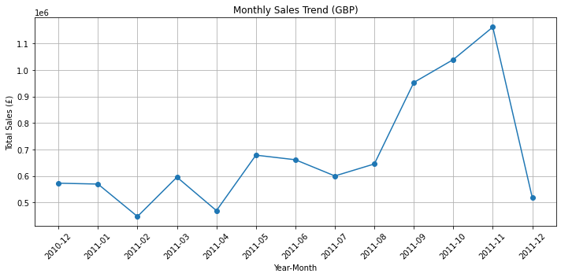
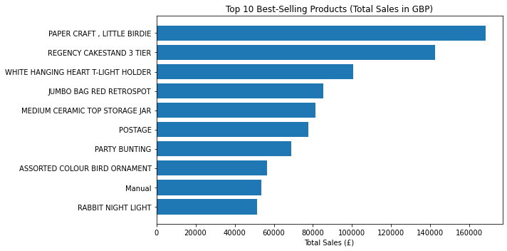
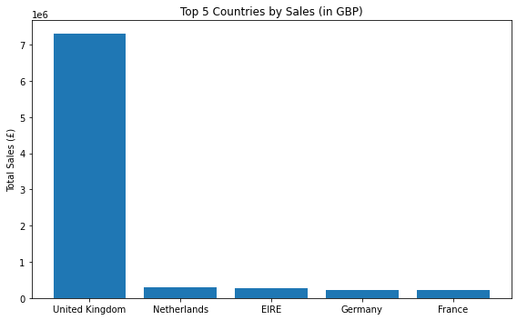
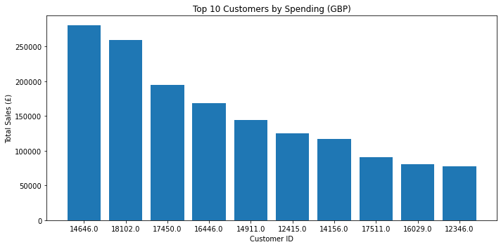

```python
df=pd.read_csv("Downloads/ecommerce_data.csv",encoding="ISO-8859-1")
```


```python
import pandas as pd
```


```python
df.head()
```


<div>
<style scoped>
    .dataframe tbody tr th:only-of-type {
        vertical-align: middle;
    }

    .dataframe tbody tr th {
        vertical-align: top;
    }

    .dataframe thead th {
        text-align: right;
    }
</style>
<table border="1" class="dataframe">
  <thead>
    <tr style="text-align: right;">
      <th></th>
      <th>InvoiceNo</th>
      <th>StockCode</th>
      <th>Description</th>
      <th>Quantity</th>
      <th>InvoiceDate</th>
      <th>UnitPrice</th>
      <th>CustomerID</th>
      <th>Country</th>
    </tr>
  </thead>
  <tbody>
    <tr>
      <th>0</th>
      <td>536365</td>
      <td>85123A</td>
      <td>WHITE HANGING HEART T-LIGHT HOLDER</td>
      <td>6</td>
      <td>12/1/2010 8:26</td>
      <td>2.55</td>
      <td>17850.0</td>
      <td>United Kingdom</td>
    </tr>
    <tr>
      <th>1</th>
      <td>536365</td>
      <td>71053</td>
      <td>WHITE METAL LANTERN</td>
      <td>6</td>
      <td>12/1/2010 8:26</td>
      <td>3.39</td>
      <td>17850.0</td>
      <td>United Kingdom</td>
    </tr>
    <tr>
      <th>2</th>
      <td>536365</td>
      <td>84406B</td>
      <td>CREAM CUPID HEARTS COAT HANGER</td>
      <td>8</td>
      <td>12/1/2010 8:26</td>
      <td>2.75</td>
      <td>17850.0</td>
      <td>United Kingdom</td>
    </tr>
    <tr>
      <th>3</th>
      <td>536365</td>
      <td>84029G</td>
      <td>KNITTED UNION FLAG HOT WATER BOTTLE</td>
      <td>6</td>
      <td>12/1/2010 8:26</td>
      <td>3.39</td>
      <td>17850.0</td>
      <td>United Kingdom</td>
    </tr>
    <tr>
      <th>4</th>
      <td>536365</td>
      <td>84029E</td>
      <td>RED WOOLLY HOTTIE WHITE HEART.</td>
      <td>6</td>
      <td>12/1/2010 8:26</td>
      <td>3.39</td>
      <td>17850.0</td>
      <td>United Kingdom</td>
    </tr>
  </tbody>
</table>
</div>


```python
df.info()
```

    <class 'pandas.core.frame.DataFrame'>
    RangeIndex: 541909 entries, 0 to 541908
    Data columns (total 8 columns):
     #   Column       Non-Null Count   Dtype  
    ---  ------       --------------   -----  
     0   InvoiceNo    541909 non-null  object 
     1   StockCode    541909 non-null  object 
     2   Description  540455 non-null  object 
     3   Quantity     541909 non-null  int64  
     4   InvoiceDate  541909 non-null  object 
     5   UnitPrice    541909 non-null  float64
     6   CustomerID   406829 non-null  float64
     7   Country      541909 non-null  object 
    dtypes: float64(2), int64(1), object(5)
    memory usage: 33.1+ MB


```python
df = df.dropna(subset=['CustomerID'])
```


```python
df['InvoiceDate'] = pd.to_datetime(df['InvoiceDate'])
```


```python
df['TotalPrice'] = df['Quantity'] * df['UnitPrice']
```


```python
df['YearMonth'] = df['InvoiceDate'].dt.to_period('M').astype(str)
```


```python
df = df[~df['InvoiceNo'].str.contains('C', na=False)]
```


```python
import matplotlib.pyplot as plt
%matplotlib inline
```


```python
monthly_sales = df.groupby('YearMonth')['TotalPrice'].sum().reset_index()
```


```python
plt.figure(figsize=(10, 5))
plt.plot(monthly_sales['YearMonth'], monthly_sales['TotalPrice'], marker='o')
plt.title('Monthly Sales Trend (GBP)')
plt.xlabel('Year-Month')
plt.ylabel('Total Sales (£)')
plt.xticks(rotation=45)
plt.grid(True)
plt.tight_layout()
plt.savefig('Monthly_Sales_Trend.png')
plt.show()
```





```python
top_products = (
    df.groupby('Description')['TotalPrice']
    .sum()
    .sort_values(ascending=False)
    .head(10)
    .reset_index()
)
```


```python
plt.figure(figsize=(10, 5))
plt.barh(top_products['Description'], top_products['TotalPrice'])
plt.title('Top 10 Best-Selling Products (Total Sales in GBP)')
plt.xlabel('Total Sales (£)')
plt.gca().invert_yaxis()  
plt.tight_layout()
plt.savefig('Best_Selling_Pro.png')
plt.show()
```





```python
top_countries = (
    df.groupby('Country')['TotalPrice']
    .sum()
    .sort_values(ascending=False)
    .head(5)
    .reset_index()
)

plt.figure(figsize=(8, 5))
plt.bar(top_countries['Country'], top_countries['TotalPrice'])
plt.title('Top 5 Countries by Sales (in GBP)')
plt.ylabel('Total Sales (£)')
plt.tight_layout()
plt.savefig('Top5_Countries_Sales.png')
plt.show()
```





```python
top_customers = (
    df.groupby('CustomerID')['TotalPrice']
    .sum()
    .sort_values(ascending=False)
    .head(10)
    .reset_index()
)

plt.figure(figsize=(10, 5))
plt.bar(top_customers['CustomerID'].astype(str), top_customers['TotalPrice'])
plt.title('Top 10 Customers by Spending (GBP)')
plt.xlabel('Customer ID')
plt.ylabel('Total Sales (£)')
plt.tight_layout()
plt.savefig('Top10_Customers.png')
plt.show()

```




